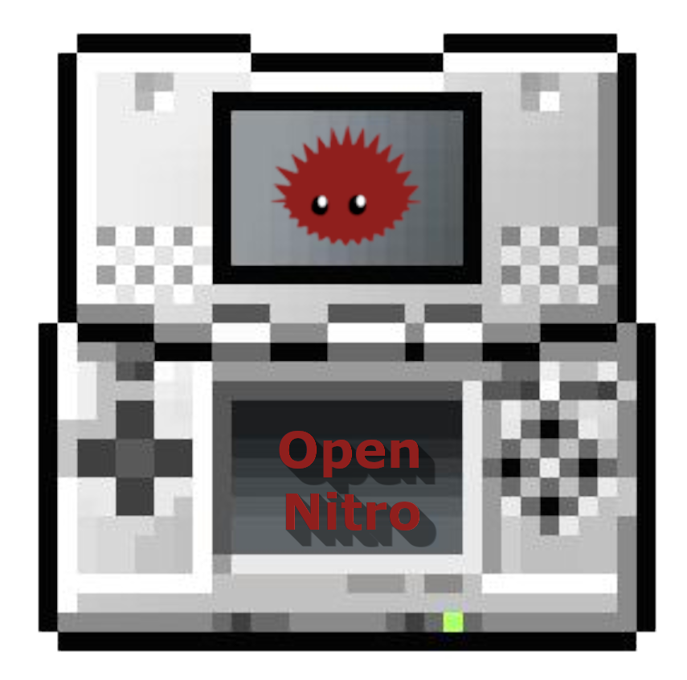

   

The OpenNitro (NTR) project is an open-source implementation of the Nintendo DS (NTR) BIOS.

## Goals

- Provide a fully-functional, open-source ARM7 and ARM9 BIOS for the NTR (original Nintendo DS) device.
- Fix a couple of bugs in the official implementation, such as in the CPUFastCopy routine to improve performance.

### Non-goals

- Binary parity - due to the vastly different tooling available today, it is practically impossible to achieve binary parity across the entire BIOS without writing Rust code that loses all intelligibility. That being said, functions will be located at the same offsets as in the original binary where possible.

### Quirks

There is currently a Rust/LLVM bug which causes `@llvm.memcpy` to be emitted inappropriately on a call to `core::slice::copy_from_slice` (or more specifically, `core::ptr::copy_nonoverlapping`). The resultant code is significantly larger _and_ slower. This is particularly naughty, as we are using `opt-level = 'z'`, which should prevent this before even considering that it makes performance worse as well!

In this case, this creates a serious linkage problem, because another (`__aeabi_memcpy4`) function is being forced upon us and there is _no_ option to prevent or inline this. There is currently no easy solution, other than un-Rustifying a handful of routines. 

## Current progress

- [ ] ARM7 BIOS (__WIP__)
- [ ] ARM9 BIOS (__NOT STARTED__)

